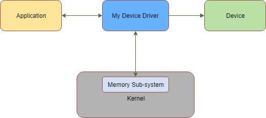
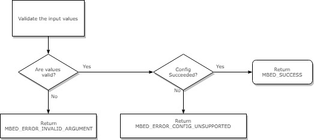
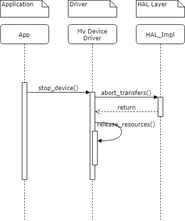

# Your feature title here, for example `Serial Driver for Mbed-OS`

# Table of Contents
- [Your feature title here, for example `Serial Driver for Mbed-OS`](#your-feature-title-here-for-example-serial-driver-for-mbed-os)
- [Table of Contents](#table-of-contents)
- [Introduction](#introduction)
    - [Overview and Background](#overview-and-background)
    - [Requirements and Assumptions](#requirements-and-assumptions)
- [System Architecture and High-Level Design](#system-architecture-and-high-level-design)
    - [High Level Design Goal 1< Example: `Configuring the device`>](#high-level-design-goal-1-example-configuring-the-device)
    - [High Level Design Goal 2< Example: `Starting and stopping the device`>](#high-level-design-goal-2-example-starting-and-stopping-the-device)
    - [High Level Design Goal 2< Example: `Add functionalities to read and write from the device`>](#high-level-design-goal-2-example-add-functionalities-to-read-and-write-from-the-device)
    - [High Level Design Goal N< Example: `Reseting the device`>](#high-level-design-goal-n-example-reseting-the-device)
    - [System Architecture and Component Interaction](#system-architecture-and-component-interaction)
- [Detailed Design](#detailed-design)
    - [Detailed Design 1 < Example: `Configuring the device`>](#detailed-design-1--example-configuring-the-device)
        - [API Description](#api-description)
        - [Configuration Sequence Diagram](#configuration-sequence-diagram)
    - [Detailed Design 2 < Example: `Starting and stopping the device`>](#detailed-design-2--example-starting-and-stopping-the-device)
        - [API Description](#api-description-1)
        - [Sequence Diagrams for `Starting and stopping the device`](#sequence-diagrams-for-starting-and-stopping-the-device)
    - [Detailed Design 3 < Example: `Add functionalities to read and write from the device`>](#detailed-design-3--example-add-functionalities-to-read-and-write-from-the-device)
        - [API Description](#api-description-2)
        - [Sequence Diagram for `Add functionalities to read and write from the device`](#sequence-diagram-for-add-functionalities-to-read-and-write-from-the-device)
    - [Detailed Design N < Example: `Reseting the device`>](#detailed-design-n--example-reseting-the-device)
        - [API Description](#api-description-3)
        - [Sequence Diagram for `Reseting the device`](#sequence-diagram-for-reseting-the-device)
- [Usage Scenarios and Examples](#usage-scenarios-and-examples)
    - [Scenario 1  < Example: `Reading from the device`>](#scenario-1---example-reading-from-the-device)
        - [Scenario 1 Example 1. < Example: `Reading a byte from device`>](#scenario-1-example-1--example-reading-a-byte-from-device)
        - [Scenario 1 Example 2. < Example: `Reading multiple bytes from device`>](#scenario-1-example-2--example-reading-multiple-bytes-from-device)
    - [Scenario 2  < Example: `Writing to the device`>](#scenario-2---example-writing-to-the-device)
        - [Scenario 2 Example 1. < Example: `Writing a byte to device`>](#scenario-2-example-1--example-writing-a-byte-to-device)
        - [Scenario 2 Example 2. < Example: `Writing multiple bytes to device`>](#scenario-2-example-2--example-writing-multiple-bytes-to-device)
- [Tools and Configuration Changes](#tools-and-configuration-changes)
    - [Tool Change 1 <E.g: -  Command line additions/changes](#tool-change-1-eg----command-line-additionschanges)
    - [Configuration Changes <E.g: -  Configuration changes in Json files etc](#configuration-changes-eg----configuration-changes-in-json-files-etc)
- [Other Information](#other-information)
    - [Reusability](#reusability)
    - [Deprecations](#deprecations)
    - [References](#references)
    - [Custom Headings Here](#custom-headings-here)

# Introduction
## Overview and Background
*Provide a background of this feature. This could be business justification for this feature, why this feature is needed, 
what is it accomplishing, what problem its solving from a high level. If you have product requirement written elsewhere 
you may also use the contents of the requirement to provide user with overall context of why this feature is needed.
For example:- This document provides a template for writing software design documents for Mbed-OS features.*

## Requirements and Assumptions
*Capture the requirements for this feature to work and other assumptions made. For example, if you are assuming specific 
hw capabilities, memory requirements, security assets like presence of RoT infrastructure, then capture those here. 
For example:- This feature requires QuadSPI interface on the target as it implements block device driver over QuadSPI 
interface. It also assumes the system can provide 16K of memory for buffering*

# System Architecture and High-Level Design
*This section provides high level information on areas or components needing changes or new development to implement this 
feature. The idea here is to capture the high level design goals of this feature for the target reader, the focus here should
be what functionality it provides and not the actual implementation. For example, if you are implementing a new device driver 
for a communication peripheral/device then the high level design goals could be as below.* 

* `Configuring the device`
* `Starting and stopping the device`
* `Add functionalities to read and write from the device`
* `Reseting the device`

*For each high level design goal, there should be corresponding section under detailed design section providing more details
on implementation.*

##	High Level Design Goal 1< Example: `Configuring the device`>
*Explain your high-level design goal 1. For example, if one of the design goal is to `Configure the device`
then explain what all configuration mechanisms are available and which are supported. For example, if the
device is a UART, then you may say this driver supports configuring spped, flow control, parity bits etc*

##	High Level Design Goal 2< Example: `Starting and stopping the device`>
*Explain your high-level design goal 2. For exmaple, if one of the design goal is for `Starting and stopping the device`
then explain the fact the software interface for starting and stopping the device will be implemented.*

##	High Level Design Goal 2< Example: `Add functionalities to read and write from the device`>
*Explain your high-level design goal 3*

##	High Level Design Goal N< Example: `Reseting the device`>
*Explain your high-level design goal N*

## System Architecture and Component Interaction
*Description and diagrams showing overall architecture of how the above-mentioned components/resources interface with each other.
For, example if the new feature is to implement a driver and if it provides interfaces with application and uses memory subsystem in OS
to talk to the device the diagram may look something like below. The goal here is to capture high level components and not the 
minute details*



# Detailed Design
*This section provides detailed design on implementation of each of the high level design goal mentioned above.
Each components/modules needing changes are also captured in details. The target audience here is a developer
who can read this section and start the real implemention. You can capture things like signature of interfaces,
flow charts showing how the APIs work, data flow diagrams etc. The headings for each detailed design section
should match the headings in high level design goals. For example, based on the example provided above,
the headings for details design sections should be `Configuring the device`, `Starting and stopping the device`, 
`Add functionalities to read and write from the device`, `Reseting the device`.*

##	Detailed Design 1 < Example: `Configuring the device`>

### API Description
*Detailed API Description like signature of interface, explanation of arguments, return codes etc.
For example, if you are trying to define an interface for configuring the device, you may describe
the API as below.*

    `Configure API should have following signature:
    mbed_error_status_t configure(int speed, enum flow_control_t flow_control, int parity_bits);`
    where:`
        speed - is an integer value representing the target communication speed
        flow_control - is the enum value representing the flow control to be used
        parity_bits - is an integer value indicating the parity_bits to be used
       
    And the function should return mbed_error_status_t value indicating the result of the call as below:
        MBED_SUCCESS if the call is successful.
        MBED_ERROR_INVALID_ARGUMENT if input values are invalid.`
        MBED_ERROR_CONFIG_UNSUPPORTED if the device doesnt support the requested configuration.`

### Configuration Sequence Diagram
*Sequence Diagrams, Data flow diagrams etc. For example, the flow chart for configure device API above may
be something like below.*



##	Detailed Design 2 < Example: `Starting and stopping the device`>

### API Description
*Detailed API Description like signature of interface, explanation of arguments, return codes etc
For example, for start and stop functions exported by the driver.*

### Sequence Diagrams for `Starting and stopping the device`
*Sequence Diagrams, Data flow diagrams etc. For example, the sequence digram for stopping the device may look
something like below.*



##	Detailed Design 3 < Example: `Add functionalities to read and write from the device`>

### API Description
*Detailed API Description like signature of interface, explanation of arguments, return codes etc*

### Sequence Diagram for `Add functionalities to read and write from the device`
*Sequence Diagrams, Data flow diagrams etc.*

##	Detailed Design N < Example: `Reseting the device`>

### API Description
*Detailed API Description like signature of interface, explanation of arguments, return codes etc*

### Sequence Diagram for `Reseting the device`
*Sequence Diagrams, Data flow diagrams etc.*

# Usage Scenarios and Examples
*Show pseudo-code or flowcharts explaining the usage of the feature. For example you may want to include 
some pseudo code to demonstrate how the read functionality is used with the new driver design you are
proposing.*

## Scenario 1  < Example: `Reading from the device`>
Mention the specific usage scenarios here. For example, the below examples shows how to read data from
device using the new APIs.

###	Scenario 1 Example 1. < Example: `Reading a byte from device`>
Mention the specific usage here. For example, the below example shows how to read a single byte data from
the device using the new APIs.

```
char in_byte = 0;
int num_bytes_read = read(&in_byte, 1);
if(num_bytes_read == 1) {
    //do something
    ...
}
```
###	Scenario 1 Example 2. < Example: `Reading multiple bytes from device`>
In this example, the code below shows how to read multiple bytes of data from the device using the new APIs.

```
char in_bytes[NUM_BYTES];
int num_bytes_read = read(in_bytes, NUM_BYTES);
if(num_bytes_read == NUM_BYTES) {
    //process bytes read
    ...
}
```
## Scenario 2  < Example: `Writing to the device`>
Mention another usage scenarios here. For example, you can demostrate how to write to the device
and few examples of usage.

###	Scenario 2 Example 1. < Example: `Writing a byte to device`>
Demonstrate the specific example here. For example, how to write a byte of data to device.

###	Scenario 2 Example 2. < Example: `Writing multiple bytes to device`>
Demonstrate another specific example here. For example, how to write mutiple bytes of data to device.

# Tools and Configuration Changes
*Explain which tools needs to be changed and the nature of changes.
For example, if the feature requires adding a new sub-command to mbed-cli capture
the details of changes and usage here. Each tool change can be captured under its own
sub-heading as below. You can also capture new configuration values which needs to be
added to mbed json based configuration system. For each, config value added explan
the name of the config value and how to use it and its relation to any pre-processor
defines in the implementation.*

## Tool Change 1 <E.g: -  Command line additions/changes

## Configuration Changes <E.g: -  Configuration changes in Json files etc

# Other Information
*Add other relevant information you would like to capture. Add custom headings if required.*

## Reusability
*List the components or pieces of implementation which can be re-used for specific 
design patterns/other implementations*

## Deprecations
*List the APIs which may be deprecated as part of this feature*

## References
*Capture information such as specifications, other design docs, other implementations Urls etc*

## Custom Headings Here
*Add your custom headings here, for example security impacts of this feature can be put
under the heading `Security Impacts`.*


